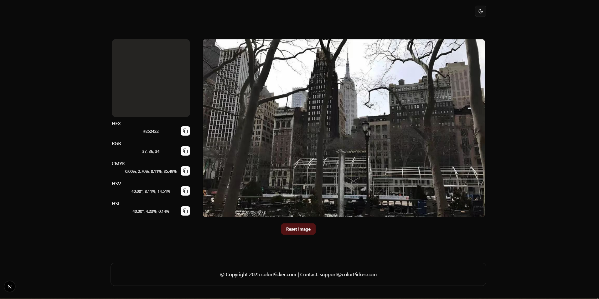

# Color Picker

This color picker tool allows users to extract colors from an uploaded image and convert them into various formats (Hex, RGB, CMYK, HSV, HSL). It includes a canvas for selecting colors, a UI to display chosen colors, and clipboard functionality for easy copying.
## Installation

1. **Clone the Repository**  
   ```bash
   git clone https://github.com/Fialex1212/nextjs-color-picker.git
   yarn
   yarn dev
## Tech Stack

- **Next.js**: A React framework for building the frontend with server-side rendering and static site generation.
- **TypeScript**: A superset of JavaScript that adds static typing, enhancing code reliability and developer experience in Next.js.
- **shadcn/ui**: A collection of reusable, customizable UI components for building consistent and accessible interfaces in Next.js.
- **sonner**: A lightweight and customizable toast notification library for displaying non-intrusive messages in React applications.
- **react-dropzone**: A React library for handling drag-and-drop file uploads with advanced features like validation and previews.

## Screenshots



## **Authors**

- [@Aleks Seriakov](https://github.com/Fialex1212)